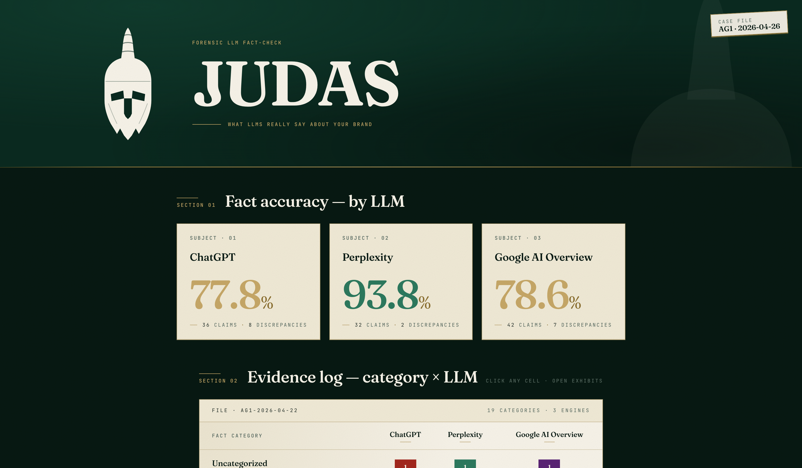
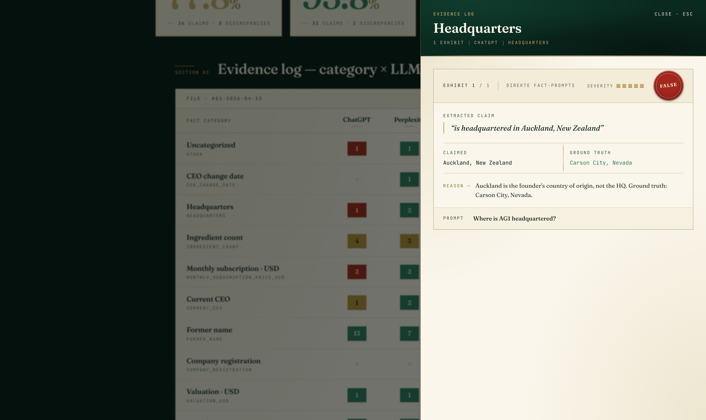

# Judas

> **Fact-checking AI search results.** When LLMs spread false or outdated information about a brand, Judas reveals the betrayal.



ChatGPT thinks AG1 is headquartered in **Auckland, New Zealand**. It is not.
Every major LLM still cites the **75-ingredient** count from the old AG1 formula — but the product has 83 ingredients since the January 2025 reformulation.
ChatGPT names a CEO who **resigned in October 2024**.

Judas surfaces all of this as forensic evidence, not vibes.

[**▶ Live dashboard**](https://ali6134.github.io/judas/) · Built for the [Peec MCP Challenge](https://peec.ai/) · Test brand: AG1

---

## What Judas does

Judas runs in three forensic phases against any brand. Each phase produces structured JSON that feeds the next.

```
        ┌──────────────┐         ┌──────────────┐         ┌──────────────┐
Peec ──►│ INTERROGATE  │ ──► JSON│   EXTRACT    │ ──► JSON│   COMPARE    │ ──► verdicts
 MCP    │  Phase 1     │         │   Phase 2    │         │   Phase 3    │
        │  Pull every  │         │  Distill     │         │  Match each  │
        │  AI response │         │  factual     │         │  claim to a  │
        │  about the   │         │  claims out  │         │  versioned   │
        │  brand       │         │  of the text │         │  ground      │
        │              │         │              │         │  truth file  │
        └──────────────┘         └──────────────┘         └──────────────┘
```

Every claim ends up classified one of five ways:

| Verdict | Meaning |
|---|---|
| **correct** | Matches ground truth (or an explicit acceptable variance) |
| **outdated** | Was true historically but no longer (old pricing, old CEO, pre-reformulation specs) |
| **false** | Contradicts ground truth and never was true |
| **hallucinated** | References something that does not exist (fabricated address, made-up partnership) |
| **unverifiable** | Plausible but not covered by the ground truth — flagged so the ground truth can grow |

Each verdict carries a 1–5 severity score. Wrong CEO and wrong ingredient count score 5; named-competitor accuracy scores 1.

---

## Findings — AG1, week of 2026-04-22

110 factual claims extracted from 38 LLM responses across 13 curated prompts × 3 engines.

| Engine | Accuracy | Correct | Wrong |
|---|---:|---:|---:|
| **Perplexity** | **93.8 %** | 30 / 32 | 2 |
| Google AI Overview | 78.6 % | 33 / 42 | 7 |
| ChatGPT | 77.8 % | 28 / 36 | 8 |

### The headline betrayals

**1. ChatGPT puts the HQ in New Zealand.**
Asked "Where is AG1 headquartered?", ChatGPT confidently answers Auckland, New Zealand. Auckland is the *founder's* country of origin. The actual HQ is Carson City, Nevada. Severity 5.



**2. Every model is a year behind on the formula.**
AG1 reformulated to "AG1 Next Gen" in January 2025, going from 75 to 83 ingredients. 10 of 12 ingredient-count claims still cite the legacy 75 (or "75+"). Verdict: `outdated`, severity 5. This is a purchase-decision-affecting drift.

**3. ChatGPT thinks Chris Ashenden is still CEO.**
Asked the current CEO, ChatGPT names Chris Ashenden and helpfully notes its September 2021 knowledge cutoff. Ashenden resigned in October 2024 amid scrutiny of his New Zealand business history. Kat Cole has been CEO since. Verdict: `outdated`, severity 5.

**Honorable mention — a hallucination.**
Google AI Overview claims AG1 is "manufactured in TGA-registered facilities (New Zealand)". TGA is *Australia*'s Therapeutic Goods Administration, not New Zealand's. Combined claim is fabricated. Verdict: `hallucinated`.

---

## How it works

### Stack

- **Pipeline** — Python + the [Peec MCP server](https://peec.ai/) for pulling LLM responses; Claude itself does the claim extraction in Phase 2 and the comparison in Phase 3, driven by the prompt templates in `prompts/`.
- **Dashboard** — Vite 6 + React 19 + TypeScript strict + Tailwind v4 + [Motion](https://motion.dev/). Fonts are Fraunces Variable, Instrument Sans Variable, and JetBrains Mono via Fontsource (no CDN at runtime).
- **Data** — Plain JSON. Versioned in the repo. The dashboard reads it via Vite's JSON loader.

### Repo layout

```
judas/
├── ground-truth/
│   └── ag1.json                    # versioned canonical facts about AG1
├── prompts/
│   ├── fact-extraction.md          # Phase 2 system prompt
│   └── fact-comparison.md          # Phase 3 system prompt
├── data/
│   ├── raw/                        # Phase 1 — raw LLM responses
│   └── analyzed/                   # Phase 2 + 3 — claims and verdicts
├── dashboard/                      # Vite app: src/, package.json, …
├── docs/
│   └── screenshots/                # README assets
└── .mcp.json                       # Peec MCP server connection
```

### Run the dashboard locally

```bash
git clone https://github.com/ali6134/judas.git
cd judas/dashboard
npm install
npm run dev
# → http://localhost:5173
```

### Run the full pipeline against your own brand

1. **Configure 10–15 fact-finding prompts** in your Peec project — direct ones ("Who is the CEO of X?") and contextual ones ("Tell me about X").
2. **Write `ground-truth/{your-brand}.json`** following the AG1 schema. Mark anything uncertain explicitly. Don't invent values.
3. **Wait 24 hours** for Peec to collect responses.
4. **Pull raw responses** via the Peec MCP server (Phase 1).
5. **Extract claims** using `prompts/fact-extraction.md` (Phase 2).
6. **Classify against ground truth** using `prompts/fact-comparison.md` (Phase 3).
7. **Point the dashboard's `src/data.ts` import** at your new files.

The three-phase MVP demonstrates the concept end-to-end. Source forensics (scraping cited URLs through Peec) and action playbooks are intentionally out of scope for v1.

---

## Why "Judas"

LLMs betray brands by repeating false or outdated facts with conviction. The forensic dossier aesthetic — Vatican archive meets classified case file — is on purpose. The drama is in the data, not the design. Words like "shocking" and "exposed" are banned from the UI; the verdicts are "correct", "outdated", "false", "hallucinated".

Tagline: *What LLMs really say about your brand.*

---

## Acknowledgements

- **[Peec AI](https://peec.ai/)** — for the MCP server that makes this possible. Their data feed across ChatGPT, Perplexity, Google AI Overview, Claude, Gemini, Grok, and Copilot is the only reason a fact-check pipeline like this is buildable in days instead of months.
- The AG1 ground truth is verified against AG1's own site, Wikipedia, NZ Herald, Athletech News, and the Peter Attia subreddit. See `ground-truth/ag1.json` for sources per fact.

---

## License

MIT — fork it, point it at your own brand.
